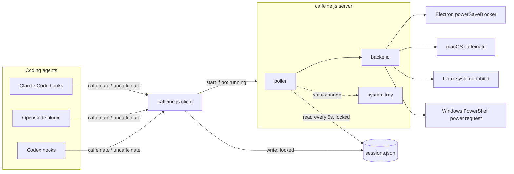

# Architecture

This guide explains how agentic-insomnia works inside, for people who want to read or change the
code. For installing and configuring it, see the [README](README.md).

## The short version

agentic-insomnia keeps a computer awake while an AI coding agent (Claude Code, OpenCode, or
Codex) is working, and lets it sleep again once the agent goes idle.

It runs two kinds of processes:

- **Clients** are short-lived. The coding agent runs `caffeine.js caffeinate` or
  `caffeine.js uncaffeinate` on its events. A client records the session in a JSON file, makes
  sure a server is running, and exits. Clients never load Electron, so hooks stay fast.
- **The server** is long-lived. Every 5 seconds it reads the session file. While at least one
  session is active, it holds a sleep lock. When no session is active, it releases the lock.

The session file is the only channel between them. Clients and the server never talk directly.



## Repository layout

| Path | Role |
|------|------|
| `caffeine.js` | Entry point. Routes `caffeinate`, `uncaffeinate`, `server`, `status`, `version`. |
| `src/commands.js` | Client commands: read the hook's JSON from stdin, update the session file, start the server. |
| `src/session.js` | The session file: add, remove, expire, read. Every access is locked. |
| `src/pid.js` | The server PID file, heartbeat, startup marker, and "is a real server running?" checks. |
| `src/server.js` | Starts the server, as an Electron app or as a plain Node process. |
| `src/poller.js` | **Decision**: when to hold or release the sleep lock. |
| `src/backend.js` | **Mechanism** seam: picks a backend and dispatches to it. |
| `src/native.js` | Native backend: `caffeinate` on macOS, `systemd-inhibit` on Linux, a PowerShell power request on Windows. |
| `src/system-tray.js` | **UI**: the tray icon and its Exit menu. Also owns server shutdown. |
| `src/electron.js` | Loads Electron only when it is needed. |
| `src/config.js` | Reads `~/.claude/plugins/agentic-insomnia/config.json` once and caches it. |
| `hooks/hooks.json` | Claude Code hook registration used by the plugin install. |
| `opencode/agentic-insomnia.mjs` | OpenCode plugin. One file, because OpenCode loads one plugin file. |
| `test/` | `node --test` suites. |

## Integrations

Every coding agent ends up calling the same two client commands, so all session and timeout
logic lives in one place.

- **Claude Code** runs hooks from `hooks/hooks.json`. `UserPromptSubmit` calls `caffeinate`.
  `PreToolUse` calls `tool-start` and `PostToolUse` calls `tool-end`, which both do what
  `caffeinate` does and also mark or clear a running tool. `Stop` and `SessionEnd` call
  `uncaffeinate`. Each hook pipes `{"session_id": "..."}` to the command's stdin.
- **OpenCode** has no external hooks, so `opencode/agentic-insomnia.mjs` listens to in-process
  events. `session.created`, `command.executed`, and `message.updated` map to `caffeinate`.
  `tool.execute.before` and `tool.execute.after` map to `tool-start` and `tool-end`.
  `session.idle` and `session.deleted` map to `uncaffeinate`. The plugin then runs the same
  CLI.
- **Codex** reads the same `hooks/hooks.json`. Its hook format, event names, and
  `{"session_id": "..."}` stdin payload match Claude Code's, and it reads `CLAUDE_PLUGIN_ROOT`
  as an alias for its own `PLUGIN_ROOT`, so the file needs no Codex-specific version. Codex
  finds it through the root `plugin.json` (`extensions.com.openai.hooks`), which is the
  portable manifest Codex prefers over the `.claude-plugin/plugin.json` Claude Code reads.
  `test/plugin-manifests.test.js` guards this: it fails if a hook lands on an event Codex does
  not define, unless the event is listed as Claude-only on purpose.

The `uncaffeinate` calls are a shortcut, not the only release path. If a coding agent crashes
and never sends one, the session still expires after `stale_session_minutes`.

## The session file

Location: `~/.claude/plugins/agentic-insomnia/sessions.json`

```json
{
  "sessions": {
    "abc123": {
      "created_at": "2025-01-08T10:30:00.000Z",
      "last_activity": "2025-01-08T10:45:00.000Z"
    }
  },
  "last_updated": "2025-01-08T10:45:00.000Z"
}
```

- `caffeinate` adds a session, or updates `last_activity` and clears `ended_at` if it
  exists. `tool-start` does the same and stamps `tool_started_at`. `tool-end` and a plain
  `caffeinate` clear it, so a tool that was interrupted before `PostToolUse` fired cannot
  leave the stamp behind past the next prompt. `uncaffeinate` stamps `ended_at` rather than removing the session. Several hooks
  fire `uncaffeinate` for one turn, so an already stamped session is left alone and the
  grace window cannot be pushed forward.
- `sessionHoldsLock` decides whether a session still holds the sleep lock. A session with
  no `ended_at` holds it until `stale_session_minutes` (default 15) of silence, which is
  the fallback for a session whose `Stop` hook never fired. A tool call sends no hooks while
  it runs, so a session with `tool_started_at` also holds the lock until
  `long_tool_call_minutes` (default 120) after the tool started. That limit caps a stamp
  that `PostToolUse` never cleared. A session with `ended_at` holds
  it until `stay_awake_after_turn_minutes` (default 5) have passed, and the stale-session
  timeout no longer applies. Sessions that hold nothing are removed on every add, remove,
  and poll.
- Many hooks can fire at once, so every read and write holds a
  [proper-lockfile](https://github.com/moxystudio/node-proper-lockfile) lock. The lock is held
  only for the read-modify-write itself.
- Writes go to a temporary file that is then renamed over `sessions.json`, so a process that
  dies mid-write cannot leave a truncated file. A file that still fails to parse counts as
  having no sessions, so the lock is released instead of held forever.

### Why the grace period exists

An OS sleep assertion blocks sleep without resetting the OS idle clock. On macOS that clock
counts from the last input event and keeps running while the lock is held. So releasing the
lock the instant a turn ended let the machine sleep during the next gap between turns, even a
gap of a few seconds, once the idle clock had passed the user's sleep timeout. Holding the
lock across those gaps is the only fix that works on every backend.

macOS can truly reset the idle clock with `caffeinate -u`, but its man page states that this
turns the display on when the display is off. That costs battery and exposes the screen, and
Electron's `powerSaveBlocker` has no equivalent call. Both backends must behave alike, so it
is not used.

The `Notification` hook is deliberately absent from `hooks/hooks.json`. It fires when Claude
asks the user for permission, which means waiting for the user, not finished working. Calling
`uncaffeinate` there released the lock in the middle of a turn.

## Server lifecycle

### Idle exit

The server is detached, so nothing else ends it when the plugin is removed. The poller tracks
`state.idleSince`, the time of the first poll with no active session. After
`server_shutdown_minutes` (default 30, `0` disables) the server shuts down like an ownership
loss: it releases the lock and removes its PID file. The next hook starts a new server.

### Starting exactly one server

Hooks fire in bursts, and several clients may find "no server" at the same moment. Startup is
guarded so only one of them starts a server:

1. Inside a lock on `server.pid`, the client checks for a running server and for a recent
   `server.starting` marker (30 second grace period).
2. If neither exists, it writes the marker and releases the lock. Other clients now see the
   marker and back off.
3. It spawns the server detached, with the Node binary that runs the client: `caffeine.js
   server` for the native backend, or Electron's `cli.js` with `caffeine.js server` for the
   Electron backend. No npm, npx, or shell is involved. Electron downloads its binary the first
   time anything asks for its path, so the client never asks. `cli.js` does it inside the
   spawned process, and the hook does not wait.
4. The server takes the same lock and writes its own PID to `server.pid`, with its backend on a
   second line. `status` reads that line to report the running server's backend, which differs
   from the configured one until the server restarts after a config change.

"Is a server running?" means more than "the PID is alive", because a PID can be reused by an
unrelated process. Hooks run this check on every tool call, so it has a fast path and a slow
path:

- **Fast path**: the server's heartbeat is the modified time of `server.pid`. The server sets it
  when it writes its PID and refreshes it on every poll. A live PID whose `server.pid` was
  modified in the last 30 seconds counts as running. This costs one file read and one `stat`.
- **Slow path**: when the heartbeat is stale, `pid.js` reads the process's command line (`ps -ww`,
  or PowerShell `Get-CimInstance` on Windows) and checks that it is a caffeine server. This
  spawns a process, and PowerShell takes about a second to start.

The heartbeat refreshes the modified time only. It never rewrites or creates `server.pid`, so it
cannot overwrite the PID of a server that has replaced this one.

### Running

The server calls `startPolling(state, 5000, onStateChange, onOwnershipLost, onIdle)`. On each
tick the poller:

1. checks that `server.pid` still names this server; if another server owns it, the poller
   stops and calls `onOwnershipLost(state)` (see "Stopping"),
2. refreshes the heartbeat on `server.pid`,
3. removes expired sessions and counts the active ones, under one lock on the session file,
4. calls `enableCaffeine(state)` or `disableCaffeine(state)` if the answer changed,
5. calls `onStateChange(state)` if a UI passed one in,
6. checks the idle timeout (see "Idle exit").

If reading the session file fails, for example with a permission error, the poller leaves the
sleep lock as it is and does not count the server as idle. Once reads have failed for
`stale_session_minutes`, it releases the lock and starts the idle clock. By then every session
would have expired anyway, so a broken file cannot keep the machine awake forever.

`state` is a plain object that the server owns. Backends keep their handles on it, for example
`powerSaveBlockerId` or `caffeinateProcess`.

### Stopping

`SIGINT`, `SIGTERM`, or the tray's Exit item call `shutdownServer(state)`. It stops polling,
releases the sleep lock, destroys the tray, and removes the PID file.

A server also stops when another server has replaced it. If a startup race ever leaves two
servers running, only one owns `server.pid`. The other sees this on its next poll, runs
`shutdownServer(state)`, and exits, so it cannot keep a tray icon or sleep lock forever. A
missing or unreadable PID file does not count as replaced.

## Three concerns, kept apart

| Concern | Question | Module |
|---------|----------|--------|
| Decision | *When* should the machine stay awake? | `poller.js` |
| Mechanism | *How* is sleep prevented? | `backend.js`, `native.js` |
| UI | *What* does the user see? | `system-tray.js` |

The poller and the tray used to import each other. Two small injections break that loop:

- The poller takes an optional `onStateChange` callback instead of importing the tray. The
  tray passes `updateTrayIcon`. The native server passes nothing, so it has no UI.
- `startPolling` stores `state.stopPolling`, so shutdown can stop the poller without importing
  it.

## Sleep backends

| Backend | Config value | How it prevents sleep | Server process | Tray |
|---------|--------------|-----------------------|----------------|------|
| Electron | `"electron"` | `powerSaveBlocker.start('prevent-app-suspension')` | Electron | Yes |
| Native, macOS | `"native"` | child process `caffeinate -i` | Node | No |
| Native, Linux | `"native"` | child process `systemd-inhibit ... cat` | Node | No |
| Native, Windows | `"native"` | child process `powershell.exe` holding a power request | Node | No |

### Choosing a backend

`getSleepBackend()` in `backend.js` makes the choice once per process and caches it:

- Config is `"native"`: use `native` if `native.isAvailable()` is true. Otherwise log a warning
  and use `electron`.
- Config is `"auto"` (the default): use `native` if `native.isAutoChoice()` is true, and
  `electron` otherwise, with no warning. `isAutoChoice()` is `isAvailable()` on every platform
  except Windows, where it is false because that backend has seen little real use.
- Any other value, including `"electron"`: use `electron`.

`isAvailable()` looks for `caffeinate` on `PATH` on macOS. On Linux it needs both
`/run/systemd/system` (the machine booted with systemd) and `systemd-inhibit` on `PATH`. On
Windows it checks that `%SystemRoot%\System32\WindowsPowerShell\v1.0\powershell.exe` exists. It
does not start PowerShell, because clients call it on every hook. Every other platform returns
false.

The client uses the same function to pick which server script to spawn. The server uses it to
dispatch. Caching keeps those two answers the same for the life of the process.

### When a native tool fails

A native tool can fail to start (for example, the binary is missing) or exit right away (for
example, polkit denies the lock). If either happens within 2 seconds of starting, `native.js`
records the reason on `state.nativeFailure`, logs it once, and ignores later enable calls.
Without this guard, the poller would respawn a failing process every 5 seconds.

A tool that exits later, after running normally, is treated as a normal stop. The next poll
starts it again.

The 2 second rule does not fit Windows, because PowerShell can take longer than that to start and
fail. There, the script prints `ready` once it holds the power request. An exit before `ready` is a
failure no matter how long it took. A script that prints nothing for 15 seconds is killed and
recorded as a failure. An exit after `ready` is a normal stop.

The server does not switch to Electron after a failure at runtime. That would mean restarting
as a different kind of process.

### The Linux backend in detail

The server runs:

```
systemd-inhibit --what=sleep:idle --who=agentic-insomnia --why="coding agent session active" --mode=block cat
```

with stdin as a pipe from the server and stderr captured for error messages.

- `systemd-inhibit` asks logind for a **block** lock on `sleep` (suspend and hibernate) and
  `idle` (logind's idle action). It holds the lock while its child command runs.
- The child is `cat`, which reads the pipe from the server and never exits on its own.
- **Normal release**: the server kills `systemd-inhibit`. systemd starts its child with a
  "kill me when my parent dies" signal, so `cat` ends too, and logind drops the lock.
- **Crash release**: if the server dies, even by `SIGKILL`, the OS closes the pipe. `cat` sees
  end of input and exits, `systemd-inhibit` exits, and the lock goes away. `sleep infinity`
  would not do this, which is why the child is `cat`.

Known limits:

- Needs systemd and logind. Other init systems fall back to Electron.
- Works from a login session. Processes outside a session may be denied the lock, depending on
  the distro's polkit rules. Arch with systemd 261 allowed it from `systemd-run --user`.
- Does not stop screen blanking or locking, the same as Electron's `prevent-app-suspension`.
- Does not block lid-close suspend (`handle-lid-switch`).
- Electron on Linux talks to the desktop's session manager over D-Bus. This backend talks to
  logind, which refuses suspend requests while the lock is held. Tested on Omarchy (Arch),
  systemd 261, Hyprland. A desktop idle screen lock that uses Wayland idle inhibitors still
  locks the screen.

### The Windows backend in detail

Windows has no sleep command. The server runs the Windows PowerShell 5.1 that ships with Windows
10 and 11, by its absolute path (`%SystemRoot%\System32\WindowsPowerShell\v1.0\powershell.exe`),
with `-NoLogo -NoProfile -NonInteractive -Command <script>`, all stdio piped, and the window
hidden.

The script:

1. declares `PowerCreateRequest` and `PowerSetRequest` from `kernel32.dll` through .NET
   reflection,
2. creates a power request with the reason `agentic-insomnia: coding agent session active` and sets
   `PowerRequestSystemRequired`,
3. prints `ready`,
4. reads stdin until it closes.

- **Normal release**: the server kills PowerShell. Windows closes the request handle when the
  process exits, which ends the request.
- **Crash release**: Windows does not end a child process when its parent dies. If the server
  dies, the OS closes the stdin pipe, `ReadToEnd()` returns, and PowerShell exits. This is the
  same idea as `cat` in the Linux backend.

Why it is shaped this way:

- Electron's `powerSaveBlocker` uses the same `PowerCreateRequest` and `PowerSetRequest` API on
  Windows, so both backends behave alike.
- Reflection instead of `Add-Type`: `Add-Type` starts the C# compiler, which is slower and more
  likely to alarm antivirus software.
- No double quotes in the script, so it passes through Windows command-line quoting unchanged.
- `-Command` instead of a `.ps1` file: `-Command` is not subject to the execution policy, so no
  `-ExecutionPolicy Bypass` is needed.

Known limits:

- On Modern Standby laptops on battery, Windows ends the request 5 minutes after the sleep
  timeout. Electron has the same limit.
- Closing the lid, pressing the power button, or choosing Sleep ends all power requests.
- Does not keep the display on, the same as Electron's `prevent-app-suspension`.
- Constrained Language Mode (AppLocker, WDAC) blocks the reflection calls. The script fails
  before `ready`, and the failure is logged once.
- `powercfg /requests` shows the reason while the request is held. It needs an administrator
  terminal.

## Configuration

`config.js` merges `~/.claude/plugins/agentic-insomnia/config.json` over its defaults and caches
the result for the life of the process. A running server keeps its config until it restarts.
See the README for the settings.

Each setting is named after the thing it controls rather than after its timer:
`stay_awake_after_turn_minutes` governs the machine, `stale_session_minutes` a session record,
and `server_shutdown_minutes` the background server.

`writeExampleConfig` writes `config.example.json` into the same directory on every server
start. Most people install this as a plugin and never check out the repo, so without it the
only way to learn a setting name is the README. It is generated from `DEFAULTS` rather than
shipped as a file in the repo, so it cannot drift when a setting is added or renamed. It
rewrites the file only when the contents differ, it never reads or writes `config.json`, and a
failure to write it is logged and ignored. Only the server calls it: the client commands run on
every tool call and must not do file writes they do not need.

## Testing

Run `npm test` (Node's built-in `node --test`) and `npm run lint`. `npm run lint` fails on
violations; `npm run lint:fix` fixes what it can.

CI (`.github/workflows/ci.yml`) runs the same job on Ubuntu, macOS, and Windows, on the Node
version in `.node-version`. It checks that `package.json` and both plugin manifests have the same
version, then runs lint, the tests, and `node caffeine.js version`. Running on every OS catches
path, spawn, and line-ending problems. The tests still never depend on the machine they run on,
so a platform-specific branch is tested on every OS:

- `native.js` takes its dependencies through `setDependencies({ spawn, platform,
  commandExists, isSystemdBooted, fileExists, now })`. Tests pass a fake child process, a fixed
  platform, and a fake clock. The Windows ready timeout uses `setTimeout`, which tests replace
  with `t.mock.timers`.
- `pid.js` takes `setDependencies({ platform, now })`, so the heartbeat and Windows command-line
  checks run on any OS.
- Modules that read config or Electron are replaced in `require.cache` before the module
  under test loads. See `test/backend-native.test.js`.
- Each test reloads the module under test, so cached state (like the resolved backend) starts
  fresh.

Some behavior can only be proven on a real machine, such as whether a desktop honors a logind
lock. Check those by hand and describe what you checked in the pull request.

## Adding a sleep backend

1. Write `enableCaffeine(state)` and `disableCaffeine(state)`. Both must be safe to call twice.
   Keep any handles on `state`.
2. Write an availability check, and record startup failures on `state` so the poller does not
   retry forever.
3. Wire it into `getSleepBackend()` and the dispatch in `backend.js`.
4. If it does not need Electron, reuse the plain Node server path in `server.js`.
5. Add tests with injected dependencies and a fixed platform.
6. Update the README config table, this file, and `AGENTS.md`. Use a `feat:` commit message.
   release-please then bumps the version and writes the changelog entry. Do not edit either by
   hand.
